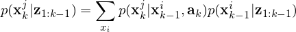
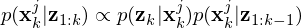

# Discrete Bayes Filter for Localization

This is a simplified bayes filter for localization. We have a robot which has the full information of the map (which looks like a face). Each yellow point means there is metal in that possition. The robot has a faulty metal detector and a faulty actuators meaning. It detects correctly if there are any metals in the current possition 0.8 of the times. And the robot fails to moves 10% of the times.

Bayes filter is based on two simple equations. First the prediction of the position given the information it has and Bayes' rule. Which is

And second, the correction of that prediction (which is made using the probability of finding that measurement given the position in we think we are)

## Results

This is the result over 200 episodes, as we can see given this maps, it works very good. Some times it gets lost but that is because the map has a lot of similar spots

## Useful tools

### Create gif

The default algorithm saves the imgs in the folder `img` in the root folder, from the `img` folder run

`convert -delay 20 -loop 0 *.png myimage.gif` 

to create the gif. Probable you will eed to install to run first 

`sudo apt-get install imagemagick`

### Additional information

The original unsolved environment is 
`https://github.com/ipab-rad/DMR_SEARCH`
